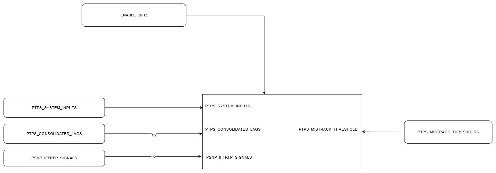

# SDLC – PTPS MisTrack Threshold Simulation

This project is a generalized simulation of my internship work at DRDO-ADE, where I contributed to the **development and testing of PTPS MisTrack Threshold logic** used in real-time embedded systems. This repository showcases the Software Development Life Cycle (SDLC) stages followed during that project, simulated using open tools and data.

## ✨ Key Contributions
- Implemented threshold logic for PTPS signal analysis and fault detection in embedded systems.
- Developed and tested PTPS MisTrack Threshold logic using MATLAB and Simulink.
- Applied MCDC coverage metrics to validate test effectiveness and meet avionics safety standards.
- Created a simulation using generic data to preserve confidentiality and demonstrate core concepts.
- Completed an end-to-end project following SDLC methodology.

## 🛠️ Tech Stack
- ADA (conceptual)
- MATLAB / Simulink
- LDRA Testing Tools (MCDC, coverage)
- Python (optional alternative for simulation)
- Git, GitHub

## 📂 Project Structure
SDLC/

├── diagrams/ # Architecture and system design

├── src/ # Simulation logic (threshold computation)

├── test/ # Test cases, coverage notes

├── docs/ # SDLC documentation

## 🧪 Simulation Overview

This simulation mimics the threshold decision logic used to detect mis-track scenarios in aircraft systems. The key inputs are:
- PTPS_SYSTEM_INPUTS
- CONSOLIDATED_LAS
- PSNP_FFRPT_SIGNALS
- ENABLE_20HZ

The output logic evaluates threshold breaches and flags mis-track based on defined conditions.

## ✅ Test Strategy
- Used conditional logic testing to simulate LDRA-style unit validation.
- Simulated input signals and verified detection conditions.
- Added dummy test cases and outputs for demonstration.

## 📘 SDLC Phases Followed
1. **Requirements Analysis** – Signal dependencies, expected behavior
2. **Design** – Functional logic and input architecture
3. **Implementation** – Simulation in MATLAB
4. **Testing** – Using assertion-based logic and dummy datasets
5. **Verification & Validation** – Modeled MCDC-like conditions
6. **Documentation** – Design diagrams and test reports

## 🔒 Disclaimer
This repository contains generalized logic based on internship experiences. It does **not** include any confidential data or code from DRDO-ADE.
